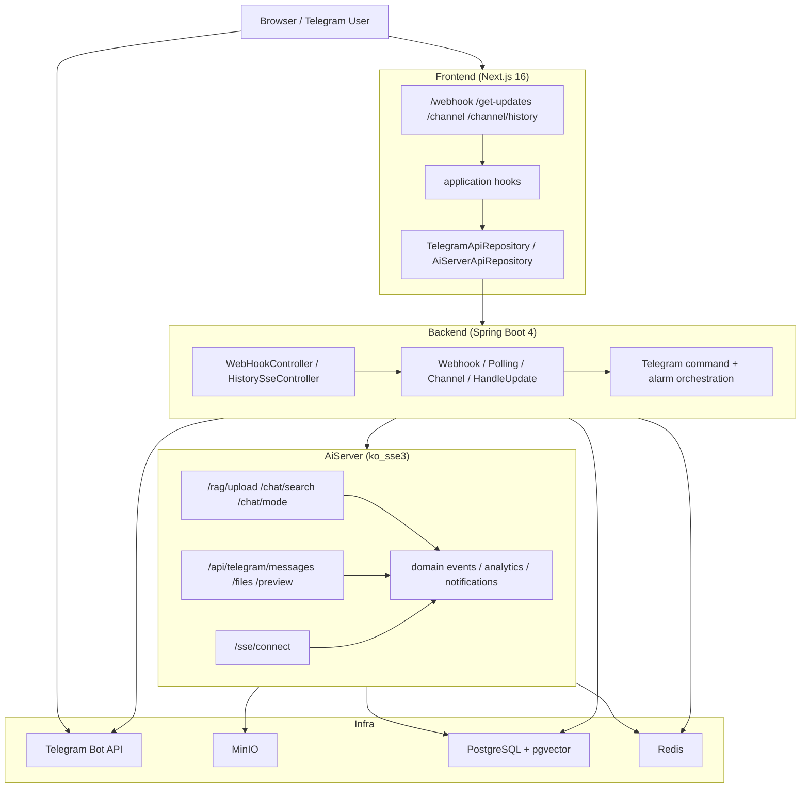
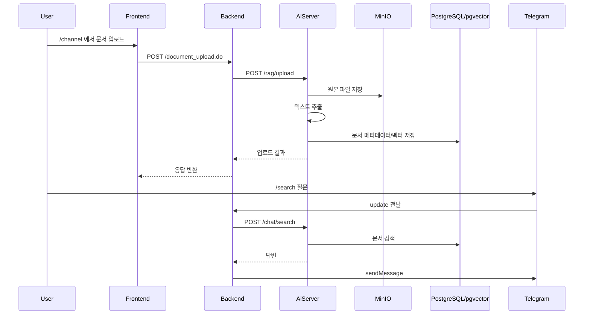
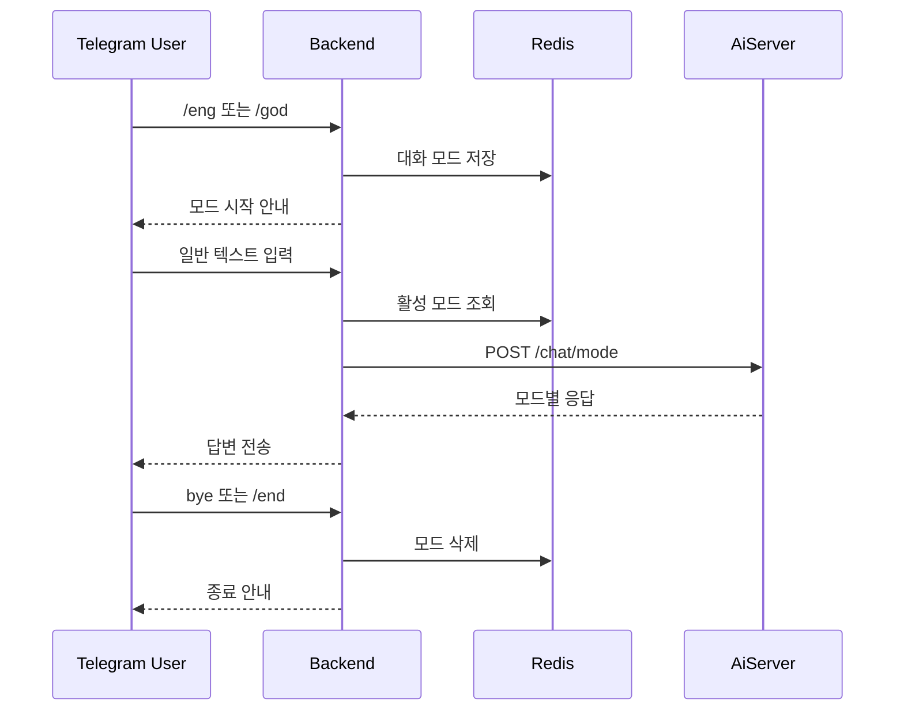
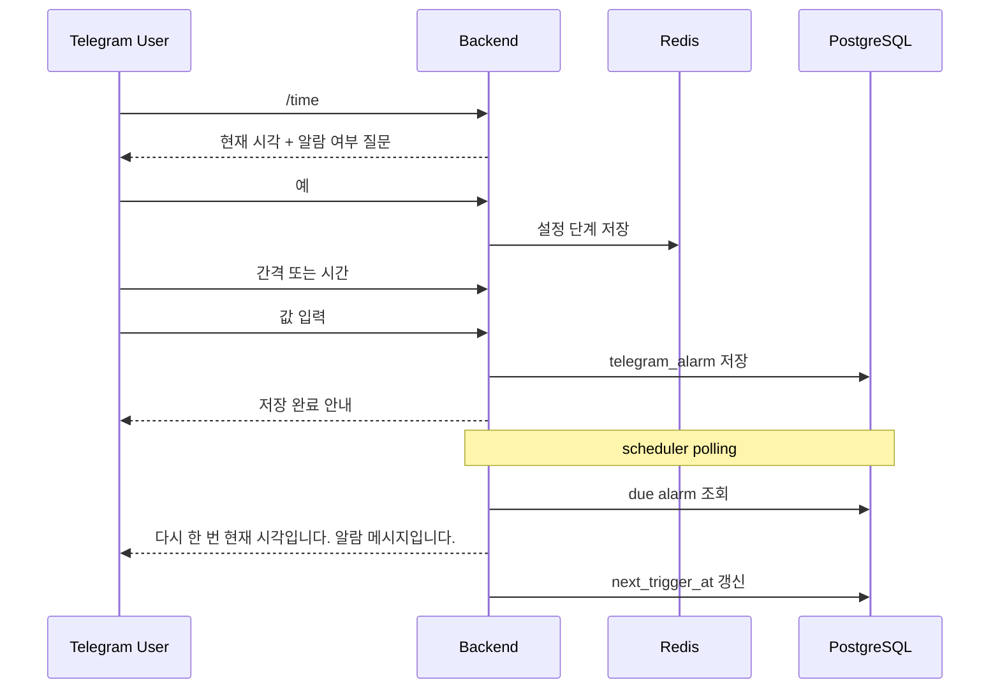
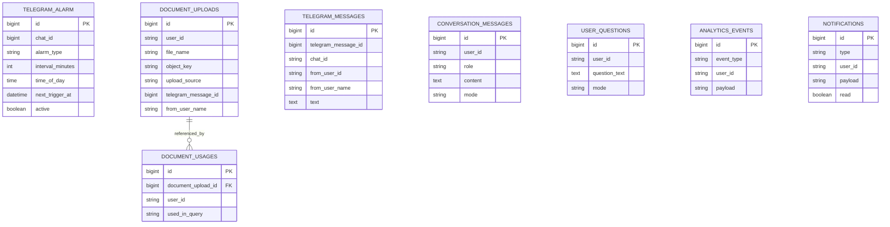

# Tellme Showme


Tellme Showme는 Telegram Bot 운영, 문서 업로드, AI 검색, 대화 모드, 이력 조회를 하나의 흐름으로 묶은 풀스택 프로젝트입니다.  
프로젝트는 `frontend`, `backend`, `AiServer(ko_sse3)` 3개 모듈로 구성되며, Telegram Bot API와 MinIO, PostgreSQL, Redis, Spring AI 기반 RAG를 연결해 운영형 봇 워크플로를 구현합니다.

## 프로젝트 개요

- `frontend`
  - Next.js 16 App Router 기반 운영 UI
  - 웹후크/폴링 제어, 채널 업로드, 히스토리/미리보기, AiServer 대화 UI 제공
- `backend`
  - Telegram Bot API 연동 게이트웨이
  - 명령 처리, 채널 브로드캐스트, 텔레그램 파일 수신, AiServer 프록시, 알람 스케줄링 담당
- `AiServer`
  - 문서 업로드/추출/검색, AI 응답 생성, SSE 스트리밍, 히스토리 저장, 검색 분석 담당

## 핵심 기능

### 운영 UI

| 구분         | 기능                    | 설명                                                  |
| ------------ | ----------------------- | ----------------------------------------------------- |
| 웹후크       | 설정/상태 조회/삭제     | Telegram webhook 등록, 상태 확인, 해제                |
| Long Polling | 수신 모니터링           | 신규 업데이트 수신과 메시지 처리 상태 확인            |
| 채널 업로드  | 텍스트/이미지/문서 전송 | `/channel`에서 업로드 후 Telegram 채널로 전송         |
| 히스토리     | 메시지/파일 조회        | 텔레그램 수신 메시지와 업로드 파일 목록, 검색, 페이징 |
| 미리보기     | 파일 프리뷰             | MinIO 파일을 backend 프록시를 통해 미리보기           |
| Ai 채팅      | 실시간 응답             | `/get-updates`에서 AiServer SSE 채팅 패널 제공        |

### 텔레그램 봇 명령

| 명령           | 동작                                           |
| -------------- | ---------------------------------------------- |
| `/start`       | 현재 지원 명령과 사용 흐름 안내                |
| `/help`        | 명령 요약과 입력 방식 안내                     |
| `/time`        | 현재 시각 안내 후 알람 설정 플로우 시작        |
| `/lotto`       | 로또 번호 생성                                 |
| `/eng`         | AiServer 영어 대화 모드 시작                   |
| `/god`         | AiServer 명언/격언 스타일 대화 모드 시작       |
| `/search 질문` | `/channel`에 업로드한 문서를 기반으로 RAG 검색 |
| `/end`         | `/eng`, `/god`, 알람 설정 흐름 종료            |
| `bye`          | `/eng`, `/god` 대화 모드 종료                  |
| 그 외 텍스트   | 기본 에코 응답 또는 활성 모드 처리             |

### 파일/문서 흐름

- Telegram 문서/사진 수신 시 backend가 파일을 다운로드한 뒤 AiServer로 전달합니다.
- `/channel` 업로드는 MinIO에 저장되고, AiServer가 텍스트를 추출해 색인합니다.
- `/search`는 업로드 문서를 기반으로 pgvector + Redis 캐시 하이브리드 검색을 수행합니다.
- 텔레그램 수신 메시지와 업로드 파일 메타데이터는 AiServer PostgreSQL에 저장됩니다.

### 대화 및 알람

- `/eng`, `/god`는 1회성 응답이 아니라 대화 모드로 동작합니다.
- 대화 모드 상태와 `/time` 알람 설정 중간 상태는 Redis에 저장합니다.
- `/time` 알람은 interval 또는 daily time 방식으로 PostgreSQL에 저장하고 scheduler가 발송합니다.

## 시스템 아키텍처



## 주요 플로우

### 1. 채널 업로드 → MinIO 저장 → RAG 검색



### 2. `/eng` 또는 `/god` 대화 모드



### 3. `/time` 알람 설정 및 발송



## 데이터 모델

현재 프로젝트는 backend와 AiServer 모두 PostgreSQL을 사용하며, Redis는 상태/세션/큐/캐시에 사용합니다.



## 기술 스택

| 구분         | 기술                                                                                     |
| ------------ | ---------------------------------------------------------------------------------------- |
| Frontend     | Next.js 16.1.6, React 19.2.3, TypeScript 5, Tailwind CSS 4                               |
| Backend      | Kotlin 2.2.21, Spring Boot 4.0.3, Spring Web/WebFlux, Spring Data JPA, Spring Data Redis |
| AiServer     | Kotlin 2.2.21, Spring Boot 4.0.3, Spring AI 2.0.0-M2, SSE, JPA, Redis                    |
| Storage      | PostgreSQL, pgvector, Redis, MinIO                                                       |
| External API | Telegram Bot API                                                                         |
| Build Tool   | Gradle 9.x, pnpm 9.x                                                                     |

## 프로젝트 구조

```text
Tellme_Showme/
├── README.md
├── backend/
│   ├── build.gradle.kts
│   └── src/main/
│       ├── kotlin/com/sleekydz86/tellme/
│       │   ├── global/
│       │   └── showme/
│       │       ├── application/
│       │       ├── domain/
│       │       └── infrastructure/
│       └── resources/application.yml
├── AiServer/
│   ├── build.gradle.kts
│   └── src/main/
│       ├── kotlin/com/sleekydz86/tellme/
│       │   ├── global/
│       │   └── aiserver/
│       │       ├── aplication/
│       │       ├── domain/
│       │       ├── infrastructure/
│       │       └── presentation/
│       └── resources/application.yml
└── frontend/
    ├── package.json
    └── src/
        ├── app/
        ├── application/
        ├── domain/
        ├── infrastructure/
        └── presentation/
```

## 실행 방법

### 요구사항

- Java 21+
- Gradle 9+
- Node.js 20+ 권장
- pnpm 9+
- PostgreSQL
- Redis
- MinIO

### 인프라 준비

기본 개발 설정은 아래 값을 기준으로 잡혀 있습니다.

| 서비스     | 기본값                    |
| ---------- | ------------------------- |
| frontend   | `http://localhost:3000`   |
| backend    | `http://localhost:8080`   |
| AiServer   | `http://localhost:6060`   |
| PostgreSQL | `localhost:5433/postgres` |
| Redis      | `127.0.0.1:9379`          |
| MinIO      | `http://localhost:9000`   |

### 6. 접속 경로

- `http://localhost:3000/webhook`
- `http://localhost:3000/get-updates`
- `http://localhost:3000/channel`
- `http://localhost:3000/channel/history`

## 현재 반영된 포인트

- Telegram 수신 메시지와 파일 이력 조회 UI/API
- MinIO 기반 문서 업로드 및 미리보기
- AiServer RAG 검색(`/search`)
- AiServer 대화 모드(`/eng`, `/god`)
- Redis 기반 대화/설정 상태 관리
- PostgreSQL 기반 알람 저장과 스케줄 발송
- SSE 기반 AiServer 실시간 채팅 패널

## 라이선스

LICENSE 파일을 참고하세요.
