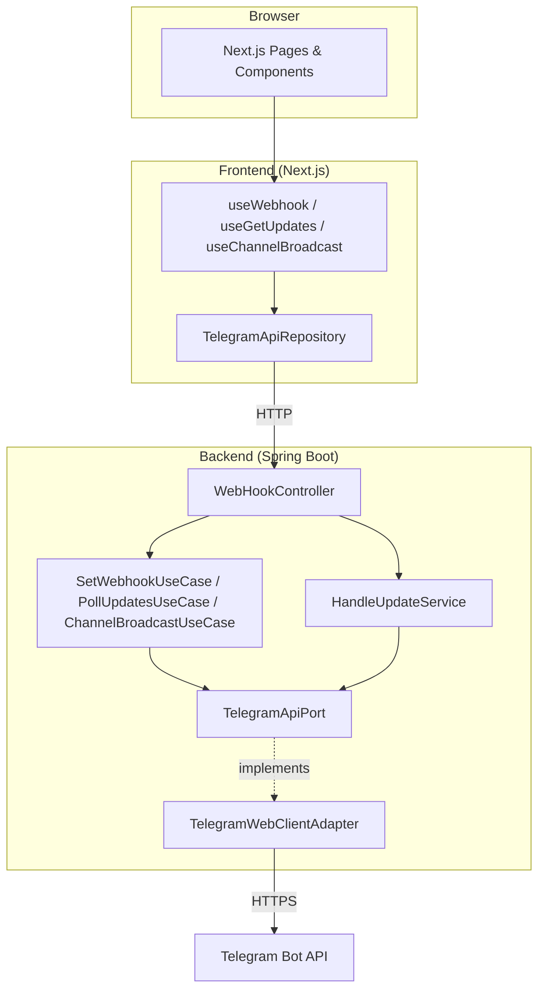
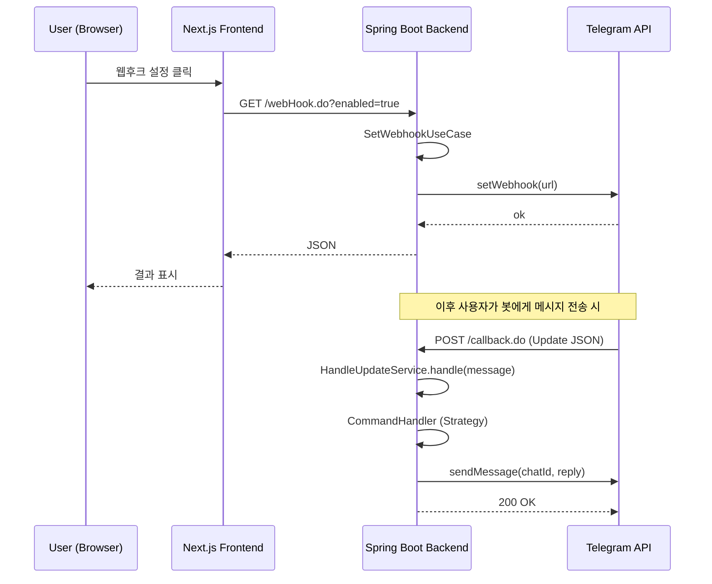
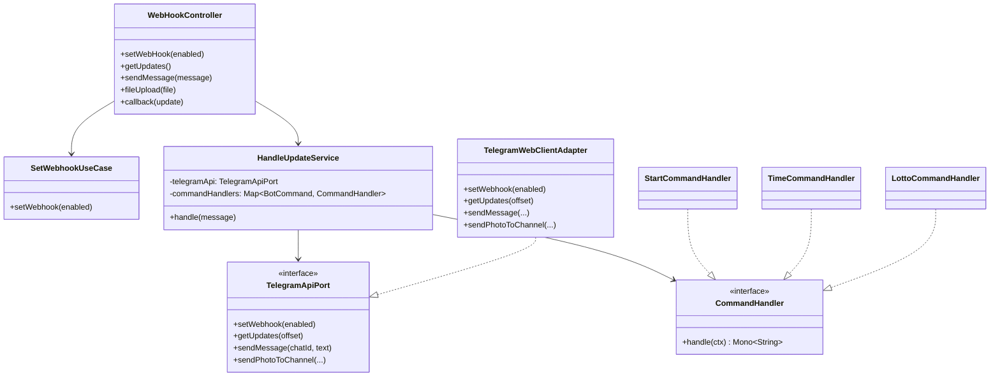
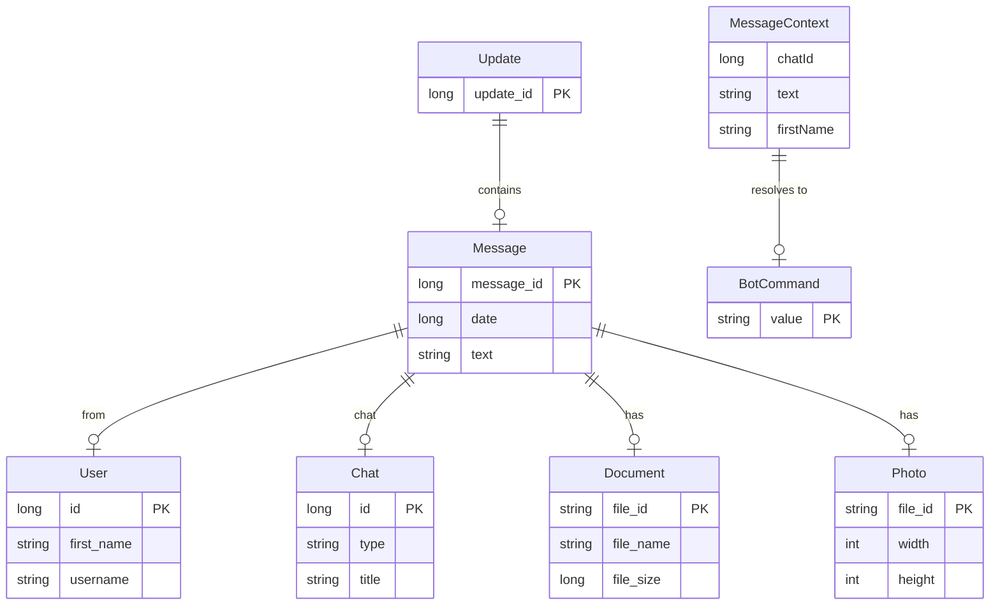

<br/>

## 프로젝트 소개<br/>

<br/>
Tellme Showme는 [Telegram Bot API](https://core.telegram.org/bots/api)를 활용한 **풀스택 봇 운영 플랫폼**입니다.  <br/>
백엔드는 **Spring Boot 4.x** 로 유스케이스·포트·어댑터를 명확히 나누었고, 프론트엔드는 **Next.js 14(App Router) 스타일 레이어**로 구성했습니다.  <br/>
웹후크 설정/해제, Long Polling 모니터링, 채널 메시지·이미지 전송을 웹 UI에서 수행할 수 있으며, 봇 명령(/start, /time, /lotto, /god, /eng,/search,/doc)으로 확장 가능하게 구현했습니다.<br/>
<br/>
- **백엔드**: Java 21, Spring Boot 4.2, WebFlux(WebClient), gradle<br/>
- **프론트엔드**: TypeScript, Next.js 16, React 18<br/>
>>>>>>>>> Temporary merge branch 2

---

## 기능

### 사용자(관리자) 기능

| 구분                  | 기능        | 설명                                                                        |
| --------------------- | ----------- | --------------------------------------------------------------------------- |
| **웹후크**            | 설정/해제   | setWebhook으로 봇 콜백 URL 등록·해제, 결과 JSON 확인                        |
| **Long Polling**      | 시작/종료   | get_updates.do 호출로 신규 메시지 수신·처리, 상태·마지막 업데이트 시간 표시 |
| **채널 브로드캐스트** | 메시지 전송 | 설정된 채널(@channel)에 텍스트 전송                                         |
| **채널 브로드캐스트** | 이미지 전송 | multipart로 이미지 파일 전송(sendPhoto)                                     |

### 봇 명령 (텔레그램 사용자 → 봇)

| 명령         | 동작                                       |
| ------------ | ------------------------------------------ |
| `/start`     | 환영 메시지 및 사용 가능 명령 안내         |
| `/time`      | 현재 시간(한국어 형식) 응답                |
| `/help`      | 도움말(명령 목록)                          |
| `/lotto`     | 1~45 중 무작위 6개 번호 응답               |
| `/god`       | 성경 구절(외부 API 또는 플레이스홀더)      |
| `/eng`       | 영어 회화 문장(외부 API 또는 플레이스홀더) |
| 그 외 텍스트 | 에코 응답                                  |

### 파일 수신 (봇 → 사용자)

- **문서/사진/음성/동영상**: 서버가 다운로드 후 저장 경로 안내 메시지 전송
- 저장 경로: `application.yml`의 `telegram.files.download-dir` (기본: `java.io.tmpdir/tellme-showme/files`)

---

## 아키텍처 구조

### 시스템 구성

```
┌─────────────────────────────────────────────────────────────────┐
│                        Browser (Next.js UI)                      │
└────────────────────────────┬────────────────────────────────────┘
                              │ HTTP (rewrites /api/proxy → :8080)
┌─────────────────────────────▼────────────────────────────────────┐
│  Next.js 16 (Frontend)  │  Spring Boot 4 (Backend)               │
│  - App Router           │  - REST (webHook.do, get_updates.do,   │
│  - domain/types, const  │    send_message.do, file_upload.do,    │
│  - application/hooks   │    callback.do)                        │
│  - infrastructure/api   │  - WebFlux WebClient → Telegram API   │
│  - presentation         │  - DDD: domain / application / infra  │
└─────────────────────────────┬────────────────────────────────────┘
                              │ HTTPS
┌─────────────────────────────▼────────────────────────────────────┐
│                    Telegram Bot API                              │
│  (setWebhook, getUpdates, sendMessage, sendPhoto, getFile, ...)   │
└──────────────────────────────────────────────────────────────────┘
```

### 백엔드 레이어 (DDD)

| 레이어             | 패키지                      | 역할                                                                                                                                                                          |
| ------------------ | --------------------------- | ----------------------------------------------------------------------------------------------------------------------------------------------------------------------------- |
| **domain**         | `domain`                    | `BotCommand`, `MessageContext` — 비즈니스 개념·값 객체                                                                                                                        |
| **application**    | `application.port`          | `TelegramApiPort`, `ExternalContentPort` — 외부 연동 계약(인터페이스)                                                                                                         |
| **application**    | `application.service`       | Use Case: `SetWebhookUseCase`, `PollUpdatesUseCase`, `ChannelBroadcastUseCase`, `HandleUpdateService` / Strategy: `CommandHandler` 구현체(Start, Time, Lotto, God, Eng, Echo) |
| **infrastructure** | `infrastructure.adapter`    | `TelegramWebClientAdapter`, `ExternalContentAdapter` — 포트 구현체                                                                                                            |
| **infrastructure** | `infrastructure.config`     | `TelegramBotConfig`, `TelegramBotProperties`, `WebConfig`(CORS)                                                                                                               |
| **infrastructure** | `infrastructure.controller` | `WebHookController` — HTTP 진입점(얇은 컨트롤러)                                                                                                                              |
| **dto**            | `dto`                       | API·Telegram 계약 DTO                                                                                                                                                         |

### 프론트엔드 레이어 (DDD 스타일)

| 레이어             | 경로                          | 역할                                                             |
| ------------------ | ----------------------------- | ---------------------------------------------------------------- |
| **domain**         | `src/domain`                  | 타입(`api.ts`), 상수(`endpoints.ts`)                             |
| **application**    | `src/application/hooks`       | 유스케이스: `useWebhook`, `useGetUpdates`, `useChannelBroadcast` |
| **infrastructure** | `src/infrastructure/api`      | `TelegramApiRepository` — 백엔드 API 호출(Repository)            |
| **presentation**   | `src/presentation/components` | `WebhookPanel`, `GetUpdatesPanel`, `ChannelBroadcastPanel`       |
| **app**            | `src/app`                     | Next.js App Router(layout, page, globals.css)                    |

---

## 대표 UML

### 1. 컴포넌트 다이어그램 (전체 시스템)



### 2. 시퀀스 다이어그램 (웹후크 설정 → 콜백 수신)



### 3. 클래스 다이어그램 (백엔드 핵심)



---

## ERD (도메인 모델)

본 프로젝트는 **별도 DB를 사용하지 않습니다.**  
아래는 “봇 업데이트·메시지·명령”을 개념적으로 모델링한 **도메인 모델 다이어그램**입니다.  
(실제 영속화 시 참고할 수 있는 엔티티 관계입니다.)



- **Update**: 텔레그램이 주는 한 건의 업데이트(웹후크/getUpdates 응답).
- **Message**: 채팅 메시지(텍스트, 발신자, 채팅방, 첨부 문서/사진 등).
- **MessageContext**: 애플리케이션에서 사용하는 “메시지 맥락” 값 객체(chatId, text, firstName).
- **BotCommand**: 봇이 인식하는 명령 열거(/start, /time, /lotto 등).

---

## 기술 스택

| 구분          | 기술                                                                          |
| ------------- | ----------------------------------------------------------------------------- |
| **Backend**   | Java 21, Spring Boot 4.2.5, Spring WebFlux(WebClient), Maven, Lombok          |
| **Frontend**  | TypeScript, Next.js 16 (App Router), React 18                                 |
| **외부 연동** | Telegram Bot API (HTTPS), 선택적 외부 API(성경/영어)                          |
| **아키텍처**  | DDD(레이어·포트·어댑터), Strategy(CommandHandler), Repository(API 클라이언트) |

---

## 프로젝트 구조

```
Tellme_Showme/
├── README.md                 # 본 문서 (포트폴리오 소개)
├── originals/
│   ├── backend/              # Spring Boot 백엔드
│   │   ├── src/main/java/com/tellme/showme/
│   │   │   ├── domain/       # BotCommand, MessageContext
│   │   │   ├── application/ # port, service (Use Case, CommandHandler)
│   │   │   ├── infrastructure/ # adapter, config, controller
│   │   │   ├── dto/
│   │   │   └── TellmeShowmeApplication.java
│   │   ├── src/main/resources/
│   │   │   ├── application.yml
│   │   │   ├── application-local.yml.example
│   │   │   └── static/       # index.html, get_updates.html, send_message.html
│   │   └── pom.xml
│   │
│   └── frontend/             # Next.js 프론트엔드
│       ├── src/
│       │   ├── app/          # layout, page, webhook, get-updates, channel
│       │   ├── domain/       # types, constants
│       │   ├── application/  # hooks (useWebhook, useGetUpdates, useChannelBroadcast)
│       │   ├── infrastructure/ # api (TelegramApiRepository)
│       │   └── presentation/ # components (WebhookPanel, GetUpdatesPanel, ChannelBroadcastPanel)
│       ├── package.json
│       ├── next.config.js
│       └── tsconfig.json
│
└── LICENSE
```

---

## 실행 방법

### 요구사항

- Java 21+, gradle9+
- Node.js 18+, pnpm

### 1. Telegram 봇 토큰

1. [@BotFather](https://t.me/BotFather)에서 봇 생성 후 토큰 발급
2. 토큰 설정 (택일):
   - **환경 변수**: `TELEGRAM_BOT_TOKEN=123456789:ABCdef...`
   - **설정 파일**: `originals/backend/src/main/resources/application-local.yml` 생성 후  
     `application-local.yml.example` 참고해 `telegram.bot.token` 등 설정

### 2. 백엔드 실행

- 기본 포트: **8080**
- 웹후크 사용 시: `TELEGRAM_WEBHOOK_URL` 또는 `application-local.yml`의 `telegram.api.webhook-url` 설정 (예: `https://your-domain.com/callback.do`)

### 3. 프론트엔드 실행

```bash
cd originals/frontend
npm install
npm run dev
```

- 기본 주소: **http://localhost:3000**
- API 호출은 `next.config.js`의 rewrites로 `http://localhost:8080`에 프록시됩니다.
- 백엔드를 다른 URL로 쓸 경우: `.env.local`에 `NEXT_PUBLIC_API_URL=http://...` 설정

### 4. 정적 HTML만 사용할 때

백엔드만 실행한 뒤 브라우저에서:

- http://localhost:8080/index.html — 웹후크 설정/해제
- http://localhost:8080/get_updates.html — Long Polling
- http://localhost:8080/send_message.html — 채널 브로드캐스트

---

## 라이선스

LICENSE 파일 참고.
